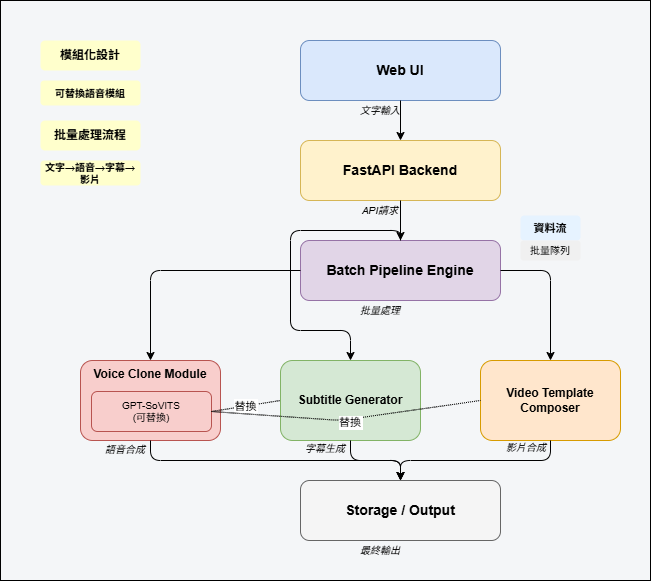

# AI 自動影片工廠

一個 **AI 驅動的自動影片生成系統**，透過完全自動化且可擴展的批次管線，將  
**文字 → 語音 → 字幕 → 模板影片**  
進行轉換。

本專案專注於使用模組化且可替換的 AI 組件來實現 **大規模個人化影片生成**
（例如 50–4000 支影片）。

---

## 這是什麼？

本專案是一個 **AI 自動影片工廠**，旨在自動化整個內容生產流程：

- 文字輸入
- AI 語音生成
- 字幕生成
- 基於模板的影片合成
- 批次處理與匯出

這個系統不是一次生成一支影片，而是專為高效且可靠地處理 **批次任務** 而設計。

---

## 系統架構

系統採用 **模組化且可替換的架構** 設計。
每個組件都可以獨立升級或更換，而不影響整體管線。

---

## 核心流程

系統遵循集中式批次處理工作流程：

1. 使用者透過 Web UI 輸入文字或結構化資料
2. FastAPI 後端驗證請求並建立批次任務
3. 批次管線引擎協調所有任務
4. 透過可插拔的 TTS 模組生成語音（預設：GPT-SoVITS）
5. 自動生成字幕
6. 使用音訊、字幕和素材合成影片模板
7. 將最終影片匯出至儲存空間

---

## 模組概覽

### Web UI
- 文字輸入
- 批次上傳（CSV / Excel）
- 模板選擇
- 任務提交與下載

### FastAPI 後端
- API 閘道
- 請求驗證
- 任務建立與生命週期控制
- 管線協調

### 批次管線引擎（核心）
- 任務編排
- 批次處理
- 任務佇列處理
- 錯誤處理與重試邏輯

### 聲音克隆 / TTS 模組（可插拔）
- 預設引擎：**GPT-SoVITS**
- 文字轉語音推理
- 輸出：WAV 音訊
- 設計為可替換（例如 XTTS、CosyVoice、Bark）

### 字幕生成器
- 文字分段
- 音訊-文字對齊
- 字幕生成（SRT / VTT）

### 影片模板合成器
- 基於模板的影片渲染
- 整合音訊、字幕、圖片和背景音樂
- 使用 ffmpeg / moviepy 建構

### 儲存 / 輸出
- 音訊檔案
- 字幕檔案
- 最終渲染影片（MP4）
- 支援本地或雲端儲存

---

## 設計原則

- **模組化架構**
- **可插拔的 AI 組件**
- **批次優先的工作流程**
- **編排與推理分離**
- **面向生產環境的管線設計**

本專案將 AI 模型視為 **可替換模組**，而管線本身才是核心產品。

---

## 目前狀態

- [x] 系統架構設計
- [x] 建立模組化管線概念
- [x] 整合聲音克隆模組（GPT-SoVITS）
- [x] 驗證批次處理工作流程
- [ ] 字幕生成優化
- [ ] 影片模板自動化改進
- [ ] Web UI 整合
- [ ] 部署與示範準備

---

## 發展藍圖

- 改善批次可靠性與監控
- 新增任務佇列與狀態追蹤
- 支援多種 TTS 引擎
- 為常見使用案例新增影片模板預設
- 準備展示與著陸頁
- 探索企業部署選項

---

## 目標使用場景

- 大規模個人化影片生成
- 企業公告與培訓影片
- 行銷與活動內容自動化
- 教育內容製作
- 宗教或組織訊息傳播

---

## 授權

本專案用於研究與產品原型開發目的。
模型授權和使用限制取決於底層 AI 組件。

---

---

# AI Auto Video Factory

An **AI-powered auto video generation system** that converts  
**text → voice → subtitles → template-based videos**  
through a fully automated and scalable batch pipeline.

This project focuses on **large-scale personalized video generation**
(e.g. 50–4000 videos) using modular and replaceable AI components.

---

## What is this?

This project is an **AI Auto Video Factory** designed to automate
the entire content production pipeline:

- Text input
- AI voice generation
- Subtitle generation
- Template-based video composition
- Batch processing and export

Instead of generating a single video at a time, this system is built
to handle **batch jobs** efficiently and reliably.

---

## System Architecture

The system is designed with a **modular and replaceable architecture**.
Each component can be independently upgraded or swapped without
affecting the overall pipeline.

---

## Core Pipeline

The system follows a centralized batch-processing workflow:

1. User inputs text or structured data via Web UI
2. FastAPI backend validates the request and creates batch jobs
3. Batch Pipeline Engine orchestrates all tasks
4. Voice is generated via a pluggable TTS module (default: GPT-SoVITS)
5. Subtitles are generated automatically
6. Video templates are composed with audio, subtitles, and assets
7. Final videos are exported to storage

---

## Modules Overview

### Web UI
- Text input
- Batch upload (CSV / Excel)
- Template selection
- Job submission and download

### FastAPI Backend
- API gateway
- Request validation
- Job creation and lifecycle control
- Pipeline coordination

### Batch Pipeline Engine (Core)
- Task orchestration
- Batch processing
- Job queue handling
- Error handling and retry logic

### Voice Clone / TTS Module (Pluggable)
- Default engine: **GPT-SoVITS**
- Text-to-speech inference
- Output: WAV audio
- Designed to be replaceable (e.g. XTTS, CosyVoice, Bark)

### Subtitle Generator
- Text segmentation
- Audio-text alignment
- Subtitle generation (SRT / VTT)

### Video Template Composer
- Template-based video rendering
- Audio, subtitle, image, and background music integration
- Built with ffmpeg / moviepy

### Storage / Output
- Audio files
- Subtitle files
- Final rendered videos (MP4)
- Supports local or cloud storage

---

## Design Principles

- **Modular architecture**
- **Pluggable AI components**
- **Batch-first workflow**
- **Separation of orchestration and inference**
- **Production-oriented pipeline design**

This project treats AI models as **replaceable modules**, while the
pipeline itself is the core product.

---

## Current Status

- [x] System architecture design
- [x] Modular pipeline concept established
- [x] Voice clone module integrated (GPT-SoVITS)
- [x] Batch processing workflow validated
- [ ] Subtitle generation refinement
- [ ] Video template automation improvements
- [ ] Web UI integration
- [ ] Deployment and demo preparation

---

## Roadmap

- Improve batch reliability and monitoring
- Add job queue and task status tracking
- Support multiple TTS engines
- Add video template presets for common use cases
- Prepare demo and landing page
- Explore enterprise deployment options

---

## Target Use Cases

- Large-scale personalized video generation
- Corporate announcements and training videos
- Marketing and campaign content automation
- Educational content production
- Religious or organizational message distribution

---

## License

This project is for research and product prototyping purposes.
Model licenses and usage restrictions depend on the underlying AI components.
